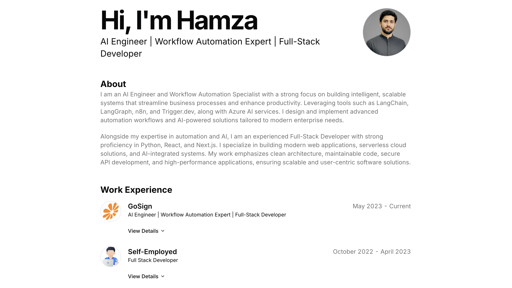

# Ali Hamza - Portfolio

A modern, responsive portfolio website showcasing my work as an AI Engineer, Workflow Automation Expert, and Full-Stack Developer.

## Overview



This portfolio website presents my professional experience, technical skills, and featured projects. Built with modern web technologies, it features a clean design, smooth animations, and optimized performance.

## About

I am an AI Engineer and Workflow Automation Specialist with a strong focus on building intelligent, scalable systems that streamline business processes and enhance productivity. I specialize in building modern web applications, serverless cloud solutions, and AI-integrated systems.

**Expertise Highlights:**
- **AI & Automation**: LangChain, LangGraph, n8n Workflow Automation, Trigger.dev
- **Backend & APIs**: Python, FastAPI, Django
- **Frontend Development**: React.js, Next.js, JavaScript, TypeScript
- **Cloud & Databases**: Azure OpenAI, Azure Cognitive Search, PostgreSQL, MySQL, Docker
- **Other**: Git, CI/CD

Currently working at GoSign, designing and implementing AI-powered automation workflows, scalable backend systems, and RAG pipelines.

## Experience Highlights

- **AI Engineer | Workflow Automation Expert | Full-Stack Developer** at GoSign (Current)
- **Full Stack Developer** - Self-Employed (Freelance)


## Featured Projects

**Pilot AI – Enterprise AI Chatbot Platform**
A scalable enterprise AI chatbot platform that enables intelligent, multimodal interactions across text, images, and documents. Built using Next.js, LangChain, Azure AI Foundry, and n8n.

**GDPR Compliance Crawler**
A comprehensive GDPR compliance tool that automatically scans websites for cookies, external resources, and potential privacy violations.

**Gosign – Centralized Dashboard Platform**
A centralized dashboard system designed to manage and streamline data, leads, and operations for 500+ kitchen retail stores across the Netherlands.

## Technologies Used

- **Framework**: Next.js
- **Language**: TypeScript
- **Styling**: Tailwind CSS
- **Deployment**: Vercel

## Getting Started

### Prerequisites

- Node.js 18.x or higher
- npm or pnpm package manager

### Installation

1. Install dependencies:

```bash
npm install
```

2. Run the development server:

```bash
npm run dev
```

3. Open your browser and navigate to `http://localhost:3000`

### Build for Production

```bash
npm run build
npm start
```

## Project Structure

```
portfolio/
├── public/          # Static assets
├── src/
│   ├── app/         # Next.js app directory
│   ├── components/  # React components
│   ├── data/        # Portfolio content including resume.tsx
│   └── styles/      # Global styles
├── package.json
└── README.md
```

## Deployment

This portfolio is deployed on Vercel. Any push to the main branch automatically triggers a new deployment.

## Performance

- Lighthouse Score: 95+
- Fully responsive design
- Optimized images and assets
- Fast page load times

---

**Live Site**: https://alihamza.dev

Built with Next.js, TypeScript, and Tailwind CSS